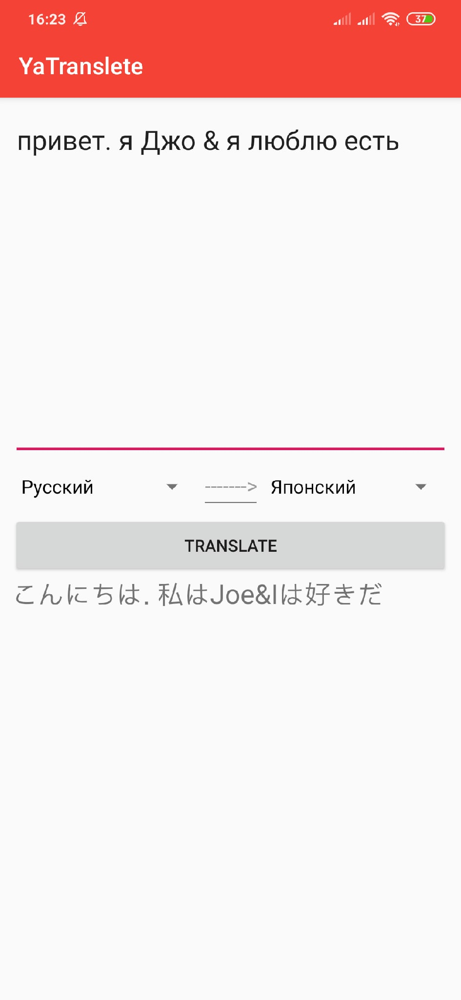
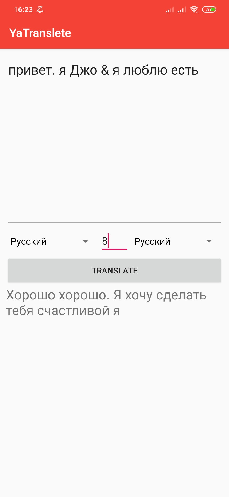

# Translator
Для перевода используется api Яндекса

## Preview
 - Реализован как обычный перевод так и транзитный ("Весёлый перевод").
Для использования обычного просто выбираем с какого на какой яызык перевести вводим текст жмём Tranlate и готово!

 - Для использования транзитного нужно списать цифру (через сколько я зыков будет сделан перевод) и дальше выбрать исходный язык и конечный язык перевода, жмём Tranlate и готово!

